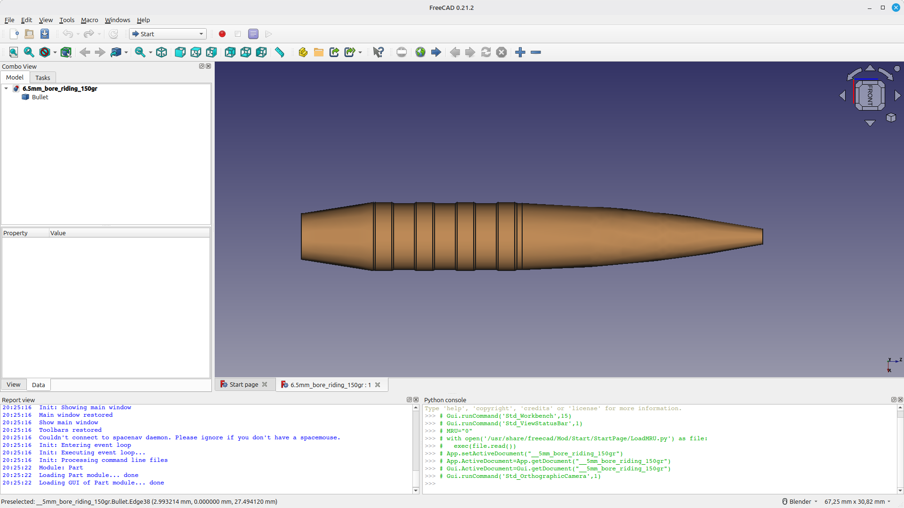
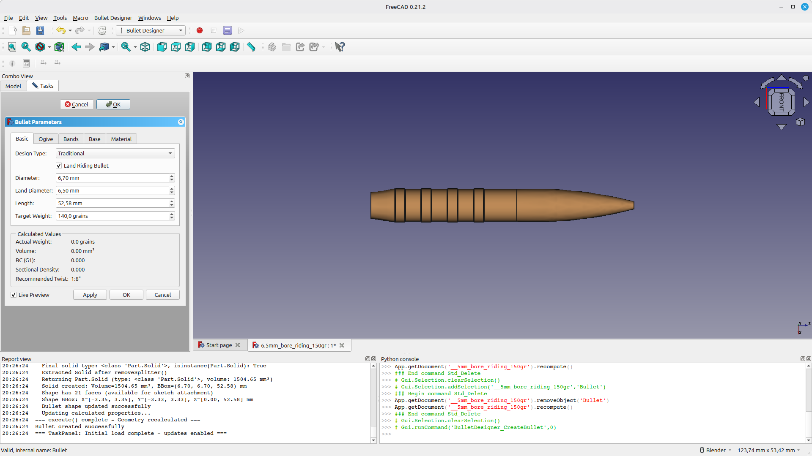

# Bullet Designer Workbench for FreeCAD

## Safety Disclaimer

This workbench is a design and calculation aid only.

Always seek professional advice before manufacturing, loading, or firing any projectile design. A wrongly designed bullet can cause violent pressure spikes that may result in personal injury, injury to others, or equipment damage.

The author or maker of this workbench is not liable for damages caused by incorrect dimensions, incorrect material selection, or incorrect tolerances.

A comprehensive FreeCAD workbench for parametric bullet and projectile design with ballistic calculations, material database, and export capabilities.



## Quick Links

- **[User Manual](USER_MANUAL.md)** - Complete guide with step-by-step instructions
- [Installation](#installation)
- [Usage](#usage)
- [Screenshots](#screenshots)

## Features

### Core Functionality

- **Parametric Bullet Design**: Create fully parametric bullets with live updates
- **Multiple Bullet Types**: Support for land-riding, flat-base, boat-tail, solid nose, hollow point, and hollow point + tip designs
- **Driving Bands**: Configurable number, spacing, and dimensions for driving bands
- **Ogive Profiles**: Three ogive types (tangent, secant, elliptical) with customizable caliber ratios
- **Ballistic Calculations**: 
  - Stability factor (Miller's formula)
  - Ballistic coefficient estimation (G1)
  - Sectional density
  - Recommended twist rate (Greenhill)
- **Trajectory Calculator**:
  - Point-mass trajectory integration (RK4)
  - Transonic zone analysis
  - Velocity decay and drop calculation
  - Spin drift estimation (Litz formula)
  - G7 ballistic coefficient conversion
- **Material Database**: Built-in materials (copper, lead, brass, gilding metal) with customizable properties
- **Export Capabilities**: Export to STEP and STL formats for manufacturing

### User Interface

- **Task Panel**: Comprehensive parameter editing with tabbed interface
- **Live Preview**: Real-time geometry updates as parameters change
- **Ballistic Calculator**: Standalone calculator dialog for stability analysis
- **Dynamic Validation Tooltips**: Nose and tip fields show calculated recommended or maximum values
- **Preferences**: Customizable defaults and units

##  Important: Bands Must Fit on Bullet

**CRITICAL**: Driving bands must fit within the body length, or **a solid will NOT be generated**.

The body length is: `Total Length - Ogive Length - Boat Tail Length`

Where Ogive Length = `(Ogive Caliber Ratio × Diameter) / 2`

Total band space needed = `(Number of Bands × Band Length) + ((Number of Bands - 1) × Band Spacing)`

**Rule**: Total Band Space ≤ Body Length

If bands don't fit, reduce bands/band length/spacing, increase total length, or reduce ogive/boat tail length.

See the [User Manual](USER_MANUAL.md#important-constraints) for detailed explanation and examples.

## Ogive Geometry Implementation

The ogive (nose section) is created using a **circular arc** defined by three points:

- **Start point**: Junction with the body (at ogive base)
- **Rim point**: Midpoint of the ogive (at 50% of ogive length, t=0.5)
- **End point**: Tip/meplat (at bullet tip)

This approach creates a **smooth, continuous arc** without visible sectional lines. The arc is mathematically precise and accurately represents the ogive curve (tangent, secant, or elliptical) based on the selected ogive type.

### Technical Details

- The ogive profile uses `Part.ArcOfCircle` to create a single smooth arc from the three points
- The rim point ensures accurate representation of the ogive curve at its midpoint
- When revolved around the Z-axis, this creates a smooth, continuous ogive surface
- The arc geometry is mathematically correct and suitable for manufacturing and export

## Screenshots


*Bullet Designer workbench and bullet creation*


*Parametric bullet design and task panel*

## Installation

### Method 1: FreeCAD Addon Manager (Recommended)

1. Open FreeCAD
2. Go to `Tools` → `Addon Manager`
3. Search for "Bullet Designer"
4. Click `Install`

### Method 2: Manual Installation

1. Clone or download this repository
2. Copy the `BulletDesigner` folder to your FreeCAD Mods directory:
   - **Linux**: `~/.FreeCAD/Mod/`
   - **Windows**: `C:\Users\<username>\AppData\Roaming\FreeCAD\Mod\`
   - **macOS**: `~/Library/Preferences/FreeCAD/Mod/`
3. Restart FreeCAD
4. Select "Bullet Designer" from the workbench dropdown

## Usage

For detailed step-by-step instructions, see the **[User Manual](USER_MANUAL.md)**.

### Creating a Bullet

1. Switch to the "Bullet Designer" workbench
2. Click the "Create Bullet" button (or use menu: `Bullet Designer` → `Create` → `Create Bullet`)
3. The task panel opens with default parameters
4. Adjust parameters in the tabs:
   - **Basic**: Diameter, length, weight
   - **Ogive**: Type, caliber ratio, meplat diameter
   - **Bands**: Number, length, spacing (** Ensure bands fit!**)
   - **Base**: Flat or boat tail configuration
   - **Nose**: Solid, hollow point, or hollow point + tip with material-aware validation
   - **Material**: Material selection and density
5. Enable "Live Preview" to see changes in real-time
6. **Verify bands fit** (see warning above)
7. Click "OK" to create the bullet object

### Using the Ballistic Calculator

1. Select a bullet object (optional)
2. Click "Ballistic Calculator" button
3. Enter or adjust parameters:
   - Bullet dimensions (or select from document)
   - Barrel twist rate
   - Muzzle velocity
   - Atmospheric conditions
4. Click "Calculate" to see results:
   - Stability factor (Sg ≥ 1.8 for monolithic copper/brass, Sg ≥ 1.5 for lead-core)
   - Ballistic coefficient
   - Sectional density
   - Recommended twist rate
   - Nose correction results (mass removed or added, corrected l, effective meplat, form factor usage)
   - Tip material velocity status (OK, WARNING, or ERROR)

### Trajectory & Transonic Calculator

1. Select a bullet object (optional) or enter parameters manually
2. Go to menu: `Bullet Designer` → `Calculate` → `Trajectory & Transonic`
3. Enter or adjust parameters:
   - Bullet dimensions (auto-filled if bullet selected)
   - Boat tail angle (for G7 BC conversion)
   - Muzzle velocity
   - Barrel elevation angle
   - Atmospheric conditions (temperature, pressure)
   - Maximum range
4. Click "Calculate" to see results:
   - Trajectory table with range, velocity, Mach, drop, spin drift, and time
   - Transonic entry/exit points
   - Stability warning at transonic entry
   - BC truing formula reference

### Exporting Bullets

1. Select a bullet object in the tree view
2. Use menu: `Bullet Designer` → `Export` → `Export to STL` or `Export to STEP`
3. Choose save location and filename
4. The geometry will be exported for use in other CAD software or 3D printing

## Parameter Reference

### Basic Dimensions

- **Diameter**: Overall bullet diameter (groove diameter) in mm
- **Land Diameter**: Land riding diameter (must be < groove diameter) in mm
- **Length**: Total bullet length in mm
- **Weight**: Target weight in grains

### Ogive Settings

- **Ogive Type**: 
  - **Tangent**: Standard tangent ogive (most common)
  - **Secant**: More aggressive secant ogive
  - **Elliptical**: Optimal aerodynamic shape
- **Ogive Caliber Ratio**: Length of ogive in calibers (typically 5-12)
- **Meplat Diameter**: Tip diameter in mm

#### What is a meplat?

The **meplat** is the small flat area at the very tip of the bullet nose.  
If the tip is not perfectly sharp, that flat circle is the meplat.

- A **smaller meplat** usually reduces drag and can improve BC.
- A **larger meplat** is blunter and can increase drag, but may be desirable for specific terminal behavior.

Examples:
- If a 6.5 mm bullet has a tip flat of 0.20 mm, the meplat is **0.20 mm**.
- In hollow point mode, the cavity opening at the tip becomes the effective meplat reference.
- In hollow point + tip mode, the tip point diameter is used as the effective meplat.

### Driving Bands

- **Number of Bands**: 0-6 driving bands
- **Band Length**: Length of each band in mm
- **Band Spacing**: Space between bands in mm
- **Band Diameter**: Usually equals groove diameter

**CRITICAL**: Bands must fit within the body length (total length minus ogive and boat tail), or a solid will not be generated. See [Important Constraints](#-important-bands-must-fit-on-bullet) above.

### Base Configuration

- **Base Type**: 
  - **Flat**: Traditional flat base
  - **Boat Tail**: Tapered base for reduced drag
- **Boat Tail Length**: Length of taper in mm
- **Boat Tail Angle**: Taper angle in degrees (typically 8-10°)

### Nose and Tip Configuration

- **Nose Type**:
  - **Solid**: legacy behavior, no cavity and no tip
  - **Hollow Point**: hollow point cavity without tip
  - **Hollow Point + Tip**: hollow point cavity with ballistic tip material
- **HP Diameter**: Must remain below both effective diameter and wall-thickness-derived maximum
- **HP Depth**: Practical ogive limit uses recommended range of approximately 50-60% of ogive length
- **Tip Base Diameter**: Must be less than or equal to HP diameter
- **Tip Tip Diameter**: Must be less than tip base diameter and above method-dependent minimum
- **Tip Material**: Functional materials are allowed; Geometry Only and Prototype are blocked for live-fire calculations
- **Tooltips**: Hovering nose and tip fields shows calculated maximums based on current geometry, material, and velocity assumptions

### Material Properties

- **Material**: Select from database or use custom
- **Density**: Material density in g/cm³ (auto-updated from material selection)

## Ballistic Calculations

### Stability Factor (Miller's Formula)

**CORRECTED FORMULA (4 Steps):**

**Step 1: Derived dimensions**
```
l = L / d_effective
t = T / d_effective
```

**Step 2: Base stability**
```
Sg = (30 × m) / (t² × d_effective³ × l × (1 + l²))
```

**Step 3: Velocity correction**
```
Sg = Sg × (V_fps / 2800)^(1/3)
```

**Step 4: Atmospheric correction (temperature + pressure combined)**
```
f_tp = (29.92 / P_inHg) × ((T_F + 460) / 519)
Sg_final = Sg × √f_tp
```

At standard conditions (59 F, 29.92 inHg), f_tp = 1.0 and no correction is applied. The temperature term increases stability at higher temperatures (less dense air); the pressure term increases stability at lower pressures (higher altitude). The square root of f_tp is applied to Sg.

**Stability thresholds:**
- **Monolithic copper/brass:** Sg_final ≥ 1.8
- **Lead-core:** Sg_final ≥ 1.5
- **1.0 < Sg_final < threshold:** Marginally stable
- **Sg_final < 1.0:** Unstable

**WHERE:**
- `m` = bullet mass (grains)
- `V_fps` = muzzle velocity (ft/sec)
- `T` = twist rate (inches per turn)
- `d_effective` = effective bullet diameter (inches) — use band diameter for land-riding bullets
- `l` = bullet length in calibers = L / d_effective
- `L` = bullet length (inches)
- `t` = twist rate in calibers per turn = T / d_effective
- `P_inHg` = measured atmospheric pressure (inches of mercury)
- `T_F` = measured temperature (Fahrenheit)

**Sources:** Litz, Applied Ballistics; Miller; Courtney & Courtney (2012)

### Ballistic Coefficient (G1)

Estimated G1 ballistic coefficient is computed from sectional density and a
geometry-derived form factor, then corrected for velocity regime and atmosphere.

Core relation:

`BC_G1 = SD / i`

Where:
- `SD = Weight (lbs) / Diameter² (inches)`
- `i` is computed from bullet geometry and flight conditions, including:
  - nose length ratio and ogive radius in calibers
  - comparison to a G1/Mayewski-style reference projectile
  - boat tail angle and boat tail length
  - meplat ratio (`meplat_diameter / bullet_diameter`)
  - Mach regime correction (subsonic, transonic, supersonic)
  - atmospheric density scaling relative to ICAO standard (1013.25 hPa, 15 C)

Notes:
- Hollow point (`hp`) still applies an HP-specific form factor penalty.
- Hollow point + tip (`hp_tip`) uses tip geometry and effective meplat handling
  without the HP penalty term.

### Sectional Density

**Formula:** `SD = Weight (lbs) / Diameter² (inches)`

Where:
- Weight in pounds = `Weight (grains) / 7000`
- Diameter in inches = `Diameter (mm) / 25.4`

Sectional density is a dimensionless number indicating the bullet's ability to retain velocity and energy.

### Weight and Volume Calculations

**Volume from Weight:**
```
Volume (mm³) = (Weight (grains) / 15.4323584) / Density (g/cm³) × 1000
```

**Weight from Volume:**
```
Weight (grains) = Volume (mm³) / 1000 × Density (g/cm³) × 15.4323584
```

### Ogive Geometry

The ogive is created as a circular arc using three points: start (junction with body), rim (midpoint), and end (tip/meplat).

**Ogive Length:**
```
L = (Ogive Caliber Ratio × Diameter) / 2
```

**Radius of Curvature (for Tangent Ogive):**
```
ρ = (R² + L²) / (2L)
```

Where:
- `ρ` = radius of curvature (mm)
- `R` = bullet radius at junction (mm)
- `L` = ogive length (mm)

The ogive curve is calculated mathematically based on the selected ogive type (tangent, secant, or elliptical), and the rim point ensures accurate representation of the curve at its midpoint.

### Recommended Twist Rate

**For Monolithic Copper/Brass Bullets (inverted Miller, Sg_target = 1.8):**
```
T_required = d_effective × √[(30 × m) / (1.8 × d_effective³ × l × (1 + l²))] × (2800 / V_fps)^(1/6)
```
With atmospheric correction applied to the required twist:
```
T_corrected = T_required × √f_tp
```
where `f_tp = (29.92 / P_inHg) × ((T_F + 460) / 519)`.

**For Lead-Core Bullets (Greenhill):**
- V ≤ 2800 fps: `T = 150 × d_effective² / L`
- V > 2800 fps: `T = 150 × d_effective² / L × √(V / 2800)`

Where:
- `T` = twist rate (inches per turn)
- `L` = length (inches)
- `m` = mass (grains)
- `V` = velocity (fps)
- `d_effective` = **effective diameter** (inches) - **use bearing band diameter for land-riding bullets**
- `l` = length in calibers = L / d_effective

**CRITICAL:** Use **d_effective** (band diameter), **NOT nominal diameter**.
- For **land-riding bullets**: `d_effective` = band diameter (typically 6.5-6.6 mm, **NOT** 6.7 mm nominal)
- For **groove-riding bullets**: `d_effective` = nominal diameter

### Trajectory & Transonic Analysis

The trajectory calculator uses a point-mass model with RK4 integration to calculate bullet flight path, velocity decay, and transonic zone analysis.

#### G7 Ballistic Coefficient

G7 BC is calculated from G1 BC using boat tail angle conversion factors:

```
BC_G7 = BC_G1 / conversion_factor
```

Conversion factors:
- **Flat base** (0°): 2.3
- **5-7° boat tail**: 2.1
- **7-9° boat tail**: 2.0
- **9-11° boat tail**: 1.95

#### Air Density

Air density calculated using ideal gas law:

```
ρ = (P_pa × 0.0289644) / (8.31446 × T_kelvin)
```

Where:
- `ρ` = air density (kg/m³)
- `P_pa` = pressure in Pascals (hPa × 100)
- `T_kelvin` = temperature in Kelvin (Celsius + 273.15)
- `0.0289644` = molar mass of dry air (kg/mol)
- `8.31446` = universal gas constant (J/(mol·K))

#### Speed of Sound

```
c = 331.3 × √(T_kelvin / 273.15)
```

Transonic thresholds:
- **Transonic entry**: Mach 1.1 = 1.1 × c
- **Transonic exit**: Mach 0.9 = 0.9 × c

#### G7 Drag Table

The calculator uses the G7 reference drag table (CD vs Mach) with linear interpolation between table points. The bullet's drag coefficient is calculated as:

```
CD = i7 × CD_G7(mach)
```

Where `i7` (G7 form factor) = `SD / BC_G7`

#### Trajectory Integration (RK4)

State vector: `[x, y, vx, vy]`

Derivatives:
```
dx/dt = vx
dy/dt = vy
dvx/dt = -(F_drag / m) × (vx / v)
dvy/dt = -(F_drag / m) × (vy / v) - g
```

Where:
- `F_drag = 0.5 × ρ × v² × CD × A`
- `A` = bullet cross-sectional area (m²)
- `m` = bullet mass (kg)
- `g` = 9.80665 m/s²

RK4 integration with time step `dt = 0.001` seconds.

#### Spin Drift (Litz Formula) — Correct form

**WRONG (do not use):** `drift_inches = 1.25 × (Sg + 1.2) × (bullet_length_calibers^1.83)` — the exponent 1.83 applies to **time of flight**, not length in calibers. Using length in calibers produces incorrect drift values.

**CORRECT:**
```
drift_inches = 1.25 × (Sg + 1.2) × (ToF^1.83)
```
Where:
- `Sg` = Miller stability factor (at muzzle)
- `ToF` = time of flight in seconds to the target

Drift is cumulative with time and converted to millimeters for display.

#### BC Truing Factor

Reference formula (display only):
```
BC_true = BC_nominal × (V_measured / V_calculated)^(1/2)
```

This formula is shown for reference; actual truing requires field measurement data.

## Material Database

Built-in materials with densities:

| Material | Density (g/cm³) | Description |
|----------|----------------|-------------|
| **Pure Copper** | 8.96 | Pure copper, excellent for monolithic bullets |
| **Gilding Metal (95/5)** | 8.86 | 95% copper, 5% zinc - common bullet jacket material |
| **Brass (70/30)** | 8.53 | 70% copper, 30% zinc - harder than gilding metal |
| **Copper Alloy** | 8.70 | General purpose copper alloy |
| **Lead Core** | 11.34 | Pure lead - traditional bullet core material |
| **Jacketed Lead Core** | 10.8 | Jacketed bullet with lead core - typical FMJ construction (gilding metal jacket + lead core) |
| **Lead-Tin Alloy (95/5)** | 11.20 | 95% lead, 5% tin - common cast bullet alloy |
| **Steel** | 7.85 | Steel core for armor-piercing bullets |
| **Tungsten Core** | 19.3 | Pure tungsten - very dense core material for armor-piercing bullets |
| **Jacketed Tungsten Core** | 18.0 | Jacketed bullet with tungsten core - high-density armor-piercing construction |

**Material Selection for Stability Calculations:**
- Materials with density **7.0-9.5 g/cm³** are treated as **monolithic copper/brass** (stability threshold: Sg ≥ 1.8)
- Materials with density **> 10 g/cm³** are treated as **lead-core** bullets (stability threshold: Sg ≥ 1.5)

Custom materials can be added through the material selection interface.

## File Structure

```
BulletDesigner/
├── Init.py                 # Workbench initialization
├── InitGui.py             # GUI initialization
├── package.xml            # Addon metadata
├── README.md              # This file
├── LICENSE                # MIT License
├── Commands/              # Command implementations
│   ├── CreateBullet.py
│   ├── BallisticCalculator.py
│   ├── TrajectoryCalculator.py
│   ├── BallisticCalculator.py
│   ├── BulletLibrary.py
│   └── ExportTools.py
├── Objects/               # Feature objects
│   ├── BulletFeature.py
│   └── ViewProviders.py
├── Gui/                   # GUI components
│   ├── BulletTaskPanel.py
│   └── PreferencesPage.py
├── Utils/                 # Utilities
│   ├── Calculations.py
│   ├── MaterialDatabase.py
│   └── GeometryHelpers.py
├── Resources/
│   ├── icons/             # SVG icons
│   └── ui/               # UI files (future)
└── Data/                  # Data files
    ├── materials.json
    └── bullet_templates.json
├── examples/              # Example files
    ├── README.md          # Examples documentation
    ├── *.FCStd           # Example FreeCAD bullet designs
    └── *.pdf             # PDF technical drawings
```

## Examples

Example bullet designs and PDF drawings are available in the `examples/` directory:

- **FreeCAD Documents (.FCStd)**: Ready-to-use bullet designs you can open, modify, and learn from
  - 6.5mm bore riding 140 gr
  - 6.5mm bore riding 150 gr
  - 6.5mm bore riding 165 gr

- **PDF Drawings**: Technical drawings with dimensions and specifications
  - 140gr bore rider 6.5mm
  - 150gr bore rider 6.5mm

See [examples/README.md](examples/README.md) for detailed descriptions of each example file.

**Note:** Example `.FCStd` files may use older stability formulas. Use the current Ballistic Calculator to recalculate stability with the updated formulas.

## Prerequisites / Dependencies

### Required Software
- **FreeCAD**: Version 0.21 or later (stable release)
- **Python**: Version 3.8 or later (included with FreeCAD)
- **PySide2**: Included with FreeCAD (Qt5 compatible)

### Compatibility
- Compatible with FreeCAD 0.21 stable release and later
- Uses PySide2 (Qt5), not PySide (Qt6)
- No third-party Python dependencies required (uses only Python standard library: math, bisect, os, sys)
- No numpy, scipy, or other external libraries required

### Backward Compatibility
This workbench requires FreeCAD 0.21 or later due to API changes. It is not backward compatible with earlier FreeCAD versions.

## Documentation

- **[User Manual](USER_MANUAL.md)**: Complete guide with step-by-step instructions, parameter explanations, troubleshooting, and best practices
- **[Changelog](CHANGELOG.md)**: Detailed list of changes and version history
- **README.md**: This file - overview and quick reference

## Limitations and Known Issues

- Bullet library browser is not yet implemented (placeholder)
- **Bands must fit on bullet**: If bands don't fit within body length, solid generation will fail (this is by design to prevent invalid geometry)

## Contributing

Contributions are welcome! Please:
1. Fork the repository
2. Create a feature branch
3. Make your changes
4. Submit a pull request

## License

This workbench is licensed under the **MIT License**. See [LICENSE](LICENSE) file for details.

## FreeCAD Forum Discussion

For questions, discussions, and community support, please create a forum thread in the [FreeCAD Forum - Addons section](https://forum.freecadweb.org/viewforum.php?f=8) and update this link with the thread URL.

## Credits

Developed for the FreeCAD community. Uses standard ballistic formulas (Greenhill, Miller) and FreeCAD's Part module for geometry generation.

## Support

For issues, questions, or feature requests, please use the GitHub issue tracker.

## Version History

### Version 1.0.0 (19 FEB 2026)
- Initial release
- Parametric bullet creation
- Ballistic calculator
- Material database
- Export to STL/STEP
- Basic preferences

## Possible future Enhancements

- Bullet library browser with presets


